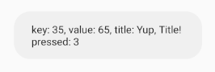
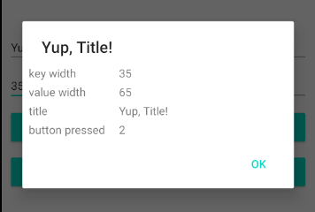

#   Flameseeker Core Library

Android - Kotlin library to improve developer quality of life code. This library contains
shortcuts and custom syntax to speed up your development phase.

Flameseeker name inspired from Guild Wars lore: **The Flameseeker Prophecy**

#   Installation

Project level `build.gradle`
```gradle
allprojects {
    repositories {
        ...
        maven { url 'https://jitpack.io' } // << Add this line
    }
}
```

Module level `build.gradle` (e.g: `app/build.gradle`)
```gradle
dependencies {
    ...
    implementation "com.github.rido-ramadan:flameseeker-core:0.2.0" // << Add this line
    ...
}
```

#   Features
*   Instant DP/SP to Pixel conversion
    ```kotlin
    // Screen density is 420dpi
    val margin: Int     = 10.dp  // 20
    val textSize: Int   = 14.sp  // 28
    val padding: Int    = "8 dp".toDP()  // 16
    val titleSize: Int  = "18sp".toSP()  // 36
    ```

*   Easy text listener with debouncing support (in milliseconds)
    ```kotlin
    val username: EditText
    username.setTextListener { text ->
        toast("Username is $text") // Invoke immediately after every char changes
    }

    val searchUsername: EditText
    searchUsername.setTextListener(300) { query ->
        toast("Searching for $query") // Only invoke after last character edit has passed 300ms
    }
    ```

*   Simplified `View` visibility (P.S. no support for `View.INVISIBLE`)
    ```kotlin
    val username: EditText

    // equals to username.visibility = View.VISIBLE
    username.visible = true
    
    // equals to: username.visibility = if (query.isNotEmpty()) View.VISIBLE else View.GONE
    username.visible = query.isNotEmpty()
    ```

*   No more need to `Toast` or `Snackbar` logging in untethered device  
    **Before**
    ```kotlin
    // This is logging to screen
    toast("key: $key, value: $value, title: $title\npressed: $counter") 
    ```
      
    **After** 
    ```kotlin
    // This is logging to screen
    showDebug(this,
        title = title,  // Optional
        entries = listOf(
            "key width" to key,
            "value width" to value,
            "title" to title,
            "button pressed" to counter
        )
    )
    ```
    